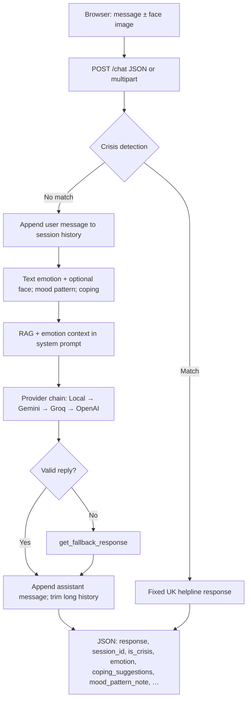

# Mental Health AI Chatbot

A Flask web app for **empathetic, general emotional support**: a browser chat UI, **retrieval-augmented generation (RAG)** with UK-focused signposting, **rule-based crisis detection** (UK helplines, bypasses the LLM), and optional **emotion-aware** and **multi-modal** cues (text + optional face image), **mood logging**, **coping suggestions**, and an **analytics dashboard**.

This project is for **education and support**, not a substitute for professional care or emergency services. See **[ETHICS_AND_PRIVACY.md](ETHICS_AND_PRIVACY.md)** for data handling and limitations.

---

## Features

| Area | What it does |
|------|----------------|
| **Chat UI** | `templates/index.html` — text chat, optional photo upload, session id in `sessionStorage`. |
| **AI backends** | Configure at least one: **local LLM** (Ollama / LM Studio), **Gemini**, **Groq**, **OpenAI**. Order: Local → Gemini → Groq → OpenAI (`get_ai_response` in `app.py`). |
| **RAG** | `data/rag_knowledge.json` + `rag.py` augment the system prompt per turn. |
| **Crisis** | Keywords, obfuscated spellings, and phrase rules (e.g. “can’t go on” vs holiday phrasing). Returns fixed UK resources; no LLM call. |
| **Fallbacks** | If every AI call fails, `get_fallback_response()` uses topic rules. |
| **Emotion (text)** | DistilRoBERTa via Hugging Face when ML deps installed; else keyword heuristic (`emotion_service.py`). |
| **Emotion (face)** | Optional ViT (`trpakov/vit-face-expression`, FER-style labels) when ML deps + image upload. |
| **Mood memory** | Optional `data/mood_events.json` + pattern hints; anonymise / disable via env (see below). |
| **Coping ideas** | `coping.py` → API + small UI hints (breathing, grounding, journaling). |
| **Dashboard** | [http://127.0.0.1:8080/dashboard](http://127.0.0.1:8080/dashboard) — Chart.js charts from `/api/analytics/summary`. |

**Optional ML install** (large download; CPU is fine):

```powershell
pip install -r requirements.txt -r requirements-ml.txt
```

Without `requirements-ml.txt`, text emotion uses the **heuristic** path and face analysis is skipped—still usable for demos.

---

## System architecture

### Layers

| Layer | Components |
|-------|------------|
| **Client** | `index.html` + `style.css`. `POST /chat` as **JSON** `{ "message", "session_id" }` or **multipart** (`message`, `session_id`, optional `face_image`). |
| **Application** | Flask `app.py`: `/`, `/chat`, `/health`, `/dashboard`, `/api/analytics/summary`. **In-memory** chat history per `session_id` (lost on restart). |
| **Safety** | Crisis rules run **before** any LLM; fixed UK helpline body returned on match. |
| **RAG** | Keyword-scored snippets merged into the system message for that turn. |
| **Emotion & mood** | Text (+ optional face) labels, coping lines, mood pattern text → appended to system prompt. Events optionally persisted in `mood_store.py` (JSON file or optional DynamoDB). |
| **Inference** | Provider chain then `get_fallback_response` if all fail. |

### Request flow



Each provider runs only if configured and earlier steps returned no usable reply. See `get_ai_response()` in `app.py`.

### Design notes

- **Chat state** lives only in memory unless you add persistence; **mood analytics** (if enabled) writes to `data/mood_events.json` (gitignored).
- **Privacy**: Local LLM keeps text on your machine; cloud APIs are subject to their terms. See **ETHICS_AND_PRIVACY.md**.
- **Configuration**: Environment variables and `.env` (never commit secrets).

---

## Quick start (local)

**Requirements:** Python 3.10+ recommended.

```powershell
cd mental-health-ai-chatbot
python -m venv .venv
.\.venv\Scripts\activate
pip install -r requirements.txt
# Optional: transformer emotion + face (first run may download model weights)
# pip install -r requirements-ml.txt

copy .env.example .env
# Edit .env: add GEMINI_API_KEY, GROQ_API_KEY, OPENAI_API_KEY, and/or LOCAL_LLM_URL

python app.py
```

- **Chat:** [http://127.0.0.1:8080](http://127.0.0.1:8080) (default `PORT=8080`).
- **Dashboard:** [http://127.0.0.1:8080/dashboard](http://127.0.0.1:8080/dashboard).

---

## API overview

| Method | Path | Purpose |
|--------|------|---------|
| `GET` | `/` | Chat page |
| `GET` | `/dashboard` | Analytics UI (Chart.js) |
| `GET` | `/api/analytics/summary` | JSON: totals, `emotion_counts`, `messages_per_day`, crisis flags count |
| `POST` | `/chat` | Body: JSON **or** `multipart/form-data`. Returns `response`, `is_crisis`, `session_id`, `emotion`, `face_emotion`, `coping_suggestions`, `mood_pattern_note` |
| `GET` | `/health` | `OK` for probes |

Disable public analytics with `ANALYTICS_API_ENABLED=false` in production if needed.

---

## Configuration

Copy `.env.example` to `.env`. **Do not commit `.env`.**

### AI & RAG

| Variable | Purpose |
|----------|---------|
| `GEMINI_API_KEY` | [Google AI Studio](https://aistudio.google.com/apikey) |
| `GROQ_API_KEY` | [Groq console](https://console.groq.com/keys) |
| `OPENAI_API_KEY` | OpenAI |
| `LOCAL_LLM_URL` | e.g. Ollama `http://localhost:11434/v1` |
| `LOCAL_LLM_MODEL` | Default `llama3.2` |
| `RAG_ENABLED` | `false` to disable RAG |
| `RAG_TOP_K` | Chunks to retrieve |
| `FLASK_SECRET_KEY` | Session / cookie secret in production |

### Emotion, mood, analytics

| Variable | Purpose |
|----------|---------|
| `USE_TRANSFORMERS_EMOTION` | `false` forces keyword-only text emotion |
| `USE_FACE_EMOTION` | `false` skips face pipeline |
| `EMOTION_TEXT_MODEL` / `EMOTION_FACE_MODEL` | Override Hugging Face model ids |
| `MOOD_TRACKING_ENABLED` | `false` disables writing mood events |
| `MOOD_ANONYMIZE` | `true` + `MOOD_HASH_SALT` hashes session keys in logs |
| `MOOD_BACKEND` | `json` (default) or `dynamodb` (AWS; see ethics doc) |
| `ANALYTICS_API_ENABLED` | `false` blocks `/api/analytics/summary` |
| `MAX_UPLOAD_MB` | Cap for face image uploads (default 8) |

Full comments live in **`.env.example`**.

---

## Production

```powershell
gunicorn -c gunicorn_config.py app:app
```

Hosting walkthrough: **[DEPLOY.md](DEPLOY.md)**. AWS reference (Lambda, API Gateway, DynamoDB, S3): **[docs/AWS_ARCHITECTURE.md](docs/AWS_ARCHITECTURE.md)**.

---

## Project layout

| Path | Role |
|------|------|
| `app.py` | Flask app, `/chat`, crisis, AI chain, fallbacks |
| `rag.py` | RAG retrieval + `augment_system_prompt` |
| `emotion_service.py` | Text + face emotion |
| `mood_store.py` | Mood events (JSON / optional DynamoDB), `analytics_summary` |
| `coping.py` | Emotion → coping strings |
| `data/rag_knowledge.json` | RAG snippets |
| `templates/index.html` | Chat |
| `templates/dashboard.html` | Analytics |
| `static/style.css` | Styles |
| `requirements.txt` | Core dependencies |
| `requirements-ml.txt` | torch, transformers, Pillow (optional) |
| `TEST_CASES.md` | Manual test ideas |
| `MODEL_EVALUATION.md` | Baseline vs BERT-family methodology notes |
| `LOCAL_LLM.md`, `RAG.md` | Feature-specific docs |

---

## Disclaimer

This chatbot does **not** provide medical, psychiatric, or emergency advice. Crisis detection is **incomplete** and may miss or over-trigger. If you or someone else is at risk, use **999** / **NHS 111** (UK) or **Samaritans 116 123**.

---

## License

No license file is included; add one if you intend to share or reuse the code under clear terms.
