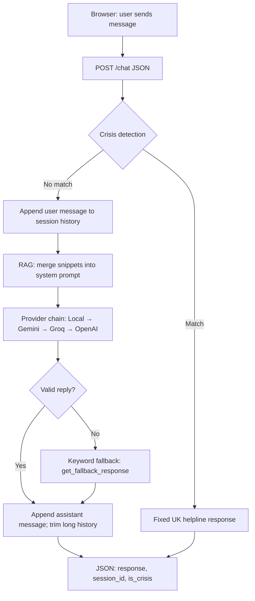

# Mental Health AI Chatbot

A Flask web app that offers **empathetic, general emotional support** through a chat interface. Replies are powered by an AI backend with **retrieval-augmented generation (RAG)** so answers can draw on curated UK-focused mental health signposting. **Crisis phrases** are detected with rule-based checks and trigger immediate **UK helpline** information instead of going through the model.

This project is for **education and support**, not a substitute for professional care or emergency services.

---

## Features

- **Web UI** — Simple chat in the browser (`templates/`, `static/`).
- **AI providers** (configure at least one): local LLM (Ollama / LM Studio), **Google Gemini**, **Groq**, or **OpenAI**. The app tries them in that order when keys or URLs are set.
- **RAG** — Snippets from `data/rag_knowledge.json` augment the system prompt for more grounded responses (see `rag.py`, `RAG.md`).
- **Crisis handling** — Messages suggesting self-harm or suicide (including common typos and obfuscated spellings) return a fixed crisis message with Samaritans, Shout, and other UK resources.
- **Fallback replies** — If all AI calls fail, topic-aware text responses in `app.py` still offer supportive copy.

---

## System architecture

### Layers

| Layer | Components |
|-------|------------|
| **Client** | Browser loads `templates/index.html` and `static/style.css`. JavaScript sends chat as `POST /chat` with JSON (`message`, `session_id`). |
| **Application** | **Flask** (`app.py`): serves the page, `/health`, and `/chat`. Holds **in-memory** conversation history keyed by `session_id` (cleared on server restart; no database). |
| **Safety** | **Rule-based crisis detection** runs on every user message **before** any LLM call. Matches run on raw text plus normalized patterns (typos / obfuscation). On match, the API returns a fixed UK helpline response and skips AI. |
| **Knowledge (RAG)** | `rag.py` reads `data/rag_knowledge.json`, scores snippets against the latest user message, and **prepends** matching content to the system prompt for that turn only (`augment_system_prompt`). |
| **Inference** | One **provider chain** per request (first success wins): **Local LLM** (OpenAI-compatible, e.g. Ollama) → **Gemini** → **Groq** → **OpenAI**. If every configured provider fails or returns nothing, **`get_fallback_response`** uses keyword rules and recent user context. |

### Request flow



The **provider chain** only calls each backend if it is configured in the environment and every earlier step returned no usable reply. See `get_ai_response()` in `app.py`.

### Design notes

- **State**: Conversations live in a Python `dict` in `app.py`, not on disk. Each tab/session should send a stable `session_id` from the client for continuity.
- **Privacy**: With a **local LLM**, prompts can stay on your machine; cloud providers receive message text per their policies when those backends are used.
- **Configuration**: All API URLs and keys come from environment variables (see `.env`).

---

## Quick start (local)

**Requirements:** Python 3.10+ recommended.

```powershell
cd mental-health-ai-chatbot
python -m venv .venv
.\.venv\Scripts\activate
pip install -r requirements.txt
copy .env.example .env
# Edit .env and add at least one API key or LOCAL_LLM_URL
python app.py
```

Open **http://127.0.0.1:8080** in your browser (or the port set by the `PORT` environment variable).

---

## Configuration

Copy `.env.example` to `.env` and set variables there. **Do not commit `.env`** — it is listed in `.gitignore`.

| Variable | Purpose |
|----------|---------|
| `GEMINI_API_KEY` | Google Gemini (free tier at [Google AI Studio](https://aistudio.google.com/apikey)) |
| `GROQ_API_KEY` | Groq ([console.groq.com](https://console.groq.com/keys)) |
| `OPENAI_API_KEY` | OpenAI |
| `LOCAL_LLM_URL` | OpenAI-compatible base URL (e.g. Ollama `http://localhost:11434/v1`) |
| `LOCAL_LLM_MODEL` | Model name for local LLM (default `llama3.2`) |
| `RAG_ENABLED` | Set to `false` to disable RAG |
| `RAG_TOP_K` | Number of knowledge chunks to retrieve |
| `FLASK_SECRET_KEY` | Secret for sessions (use a random string in production) |

See `.env.example` for the full list and comments.

---

## Production

Use **Gunicorn** (already in `requirements.txt`):

```powershell
gunicorn -c gunicorn_config.py app:app
```

For step-by-step hosting (Railway, Render, environment variables), see **[DEPLOY.md](DEPLOY.md)**.

---

## Project layout

| Path | Role |
|------|------|
| `app.py` | Flask app, chat route, crisis detection, AI chain, fallbacks |
| `rag.py` | Loads `data/rag_knowledge.json` and augments the system prompt |
| `data/rag_knowledge.json` | Curated snippets for RAG |
| `templates/index.html` | Chat page |
| `static/style.css` | Styles |
| `TEST_CASES.md` | Manual test ideas for responses |

Additional docs: `LOCAL_LLM.md`, `RAG.md`.

---

## Disclaimer

This chatbot does **not** provide medical, psychiatric, or emergency advice. If you or someone else is at risk, use emergency services (**999** / **NHS 111** in the UK) or a crisis line such as **Samaritans 116 123**.

---

## License

No license file is included in this repository; add one if you intend to share or reuse the code under clear terms.
