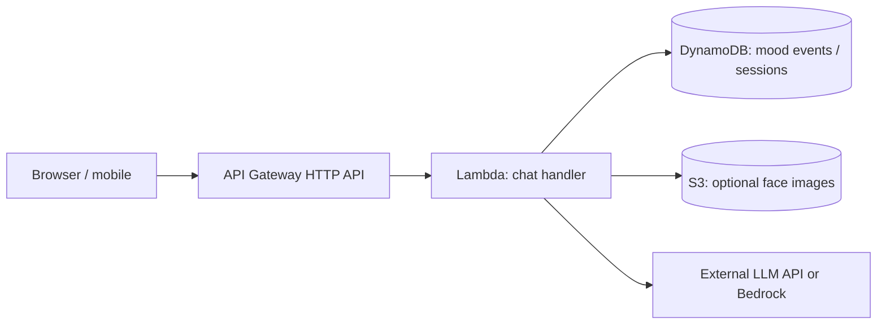

# AWS reference architecture (optional)

This repository runs as a **single Flask process** by default. For coursework or portfolio alignment with **Lambda, API Gateway, DynamoDB, S3**, the following is a common **target architecture**—implementation is left to your deployment repo or IaC.

## Mapping from this codebase

| Component | Role |
|-----------|------|
| **API Gateway** | Expose `POST /chat`, `GET /dashboard` (or host dashboard on S3+CloudFront). |
| **Lambda** | Package Flask with Mangum/ASGI adapter **or** re-implement thin handlers that call shared Python modules (`emotion_service`, `mood_store`, RAG). |
| **DynamoDB** | Set `MOOD_BACKEND=dynamodb`, `MOOD_DYNAMODB_TABLE`, `AWS_REGION`. Adjust item types for DynamoDB (`Decimal` for floats). |
| **S3** | If you **persist** face images (not default), upload from client via presigned URL; Lambda processes S3 events or reads object in chat flow. |

## Practical notes

- **Cold starts:** ML models (torch) in Lambda are large; consider **SageMaker endpoint**, **ECS/Fargate**, or **emotion inference only on GPU instances** for serious workloads.
- **Secrets:** Store API keys in **Secrets Manager** or SSM Parameter Store, not environment variables in screenshots.
- **Cost:** Add budgets and alarms in **AWS Billing**.

This file is **documentation only**—it is not an automated AWS deployment.
